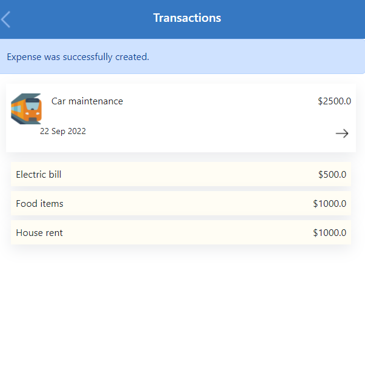

# Budget App

> This Budget App is a mobile web application designed to help you spend money responsibly. It has a list of expenses connected with a category, and you can see and account for how much money you spend and on what, as well as which category. It also displays the category and transactions one spend the most money in and the total monthly expenses, allowing you to be reasonable in making financial decisions.

## Schema


## Built With

- Ruby
- Ruby on rails
- BootStrap
- Rubocop
- Rspec & Capybara
- Devise
- cancancan

## Live Demo
[Video](https://www.loom.com/share/d38c0be3307b48f79d38af51043bb559)

## Deployment
[Heroku](https://epal-budget-app.herokuapp.com/)

[Short URL](https://tinyurl.com/epalbud)

## Get Started
To get a local copy up and running follow these simple steps.

```bash
$ git clone https://github.com/epaltechs/budget-app
$ cd budget-app
$ bundle install
$ rake db:create
$ rake db:migrate
```
## Run tests
```bash
$ bundle exec  rspec ./spec/models
$ bundle exec  rspec ./spec/features
$ bundle exec  rspec ./spec/routing
```
## 👤 Author

:bust_in_silhouette: **Emmanuel Paul**
- GitHub: [@Epaltechs](https://github.com/Epaltechs)
- LinkedIn: [Emmanuel Paul](https://www.linkedin.com/in/emmanuel-s-paul)
- Twitter: [Emmanuel Paul](http://twitter.com/@emmapaul247)
- AngeList: [Emmanuel Paul](https://angel.co/u/emmanuel-s-paul)


## 🤝 Contributing

Contributions, issues, and feature requests are welcome!

Feel free to check the [issues page](../../issues/).

## Show your support

Give a ⭐️ if you like this project!

## Acknowledgments
- Original design idea by [Gregoire Vella on Behance](https://www.behance.net/gregoirevella)
- Microverse

## 📝 License

This project is [MIT](https://opensource.org/licenses/MIT) licensed.
